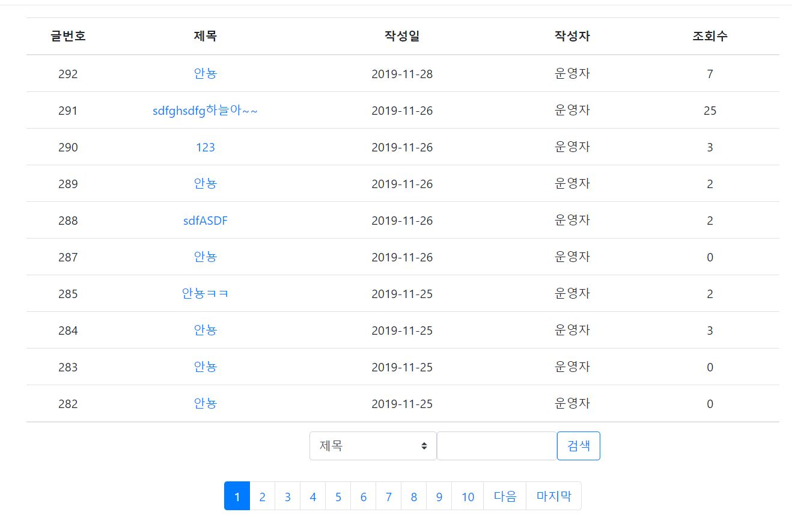
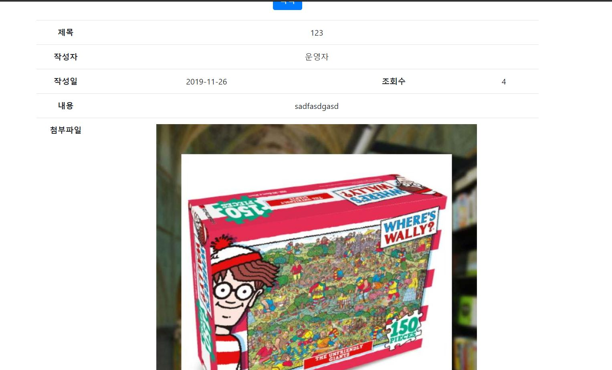

# SafeFood🍽

공공 데이터를 활용한 안전 먹거리 서비스

## 개발 목적🥄

- 사용자는 알레르기 정보를 입력하여 음식의 성분에 따라 피해야 할 음식을 미리 확인할 수 있습니다.
- 사용자가 섭취한 음식 영양 정보를 원형 그래프로 도식화하여 한 눈에 확인할 수 있습니다.
- 팔로잉, 팔로워 기능을 통해 사용자 간의 섭취 정보를 서로 공유할 수 있습니다.
- 공지사항 기능을 통해 운영자는 중요 메세지를 사용자들에게 전달할 수 있습니다.
- 게시판에 글이나 사진을 업로드하고 댓글을 달며 사용자 간 친목을 도모할 수 있습니다.
- 사용자의 활동지수에 따라 음식 리스트를 추천합니다.

## 사용 기술🍴

|                |                                                              |
| :------------: | :----------------------------------------------------------: |
| Design Pattern |                  MVC(모델-뷰-컨트롤러) 구조                  |
|   Front-End    | JSP(게시판 제외) Vue.js(게시판) jQuery(AJAX를 이용한 비동기 통신) |
|    Back-End    |                  SpringBoot(maven, MyBatis)                  |
|  데이터베이스  |                            MySQL                             |
|     Server     |             tomcat9 외장 서버를 이용한 .war 배포             |

## 주요 기능🍚

- 팔로잉, 팔로워 기능
- 날짜별 음식 섭취 기록 기능, 영양 정보 원형 그래프 도식화
- 먹고 싶은 음식 찜 기능
- 신체정보와 활동지수에 따른 최적의 음식 리스트 추천 기능(깊이 우선 탐색 기법)
- 게시판(댓글 기능 추가), 공지사항
- SHA-256 해쉬 알고리즘을 이용한 사용자 데이터베이스 비밀번호 암호화

## 시연

## 개발자👨‍💻👩‍💻

- 😇김😇도😇하😇
- 🌷이🌺수🌸민🌼
